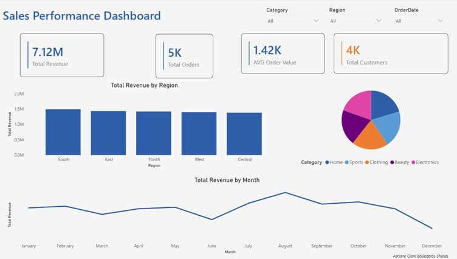

# Sales Analytics Project

End-to-end data analysis project using Excel, MySQL, Python, and Power BI on a synthetic e-commerce sales dataset (5,000 records).

## Project Overview

This project simulates a complete data analyst workflow: cleaning and exploring data in Excel, querying a relational database with MySQL, performing exploratory data analysis and visualization in Python, and building a one-page interactive dashboard in Power BI.

## Dataset

`sales_data.csv` / `sales_data.xlsx` — 5,000 rows of e-commerce order data with the following fields:

| Column | Description |
|---|---|
| OrderID | Unique order identifier |
| OrderDate | Date of purchase |
| CustomerID | Unique customer identifier |
| Age | Customer age |
| Gender | Male / Female / Other |
| Region | North, South, East, West, Central |
| Category | Product category (Electronics, Clothing, Home, Beauty, Sports) |
| Product | Specific product |
| Quantity | Units purchased |
| UnitPrice | Price per unit ($) |
| DiscountPct | Discount applied (%) |
| TotalAmount | Final order value ($) |
| SalesChannel | Online, In-Store, Mobile App |
| PaymentMethod | Credit Card, Debit Card, PayPal, Cash, UPI |

## Tools & Techniques

### 1. Excel
- Data cleaning and validation
- PivotTables for regional and category breakdowns
- Formulas: SUMIF, SUMIFS, AVERAGEIF, XLOOKUP, RANK, conditional formatting
- File: `excel/sales_data_cleaned.xlsx`

### 2. MySQL
- Database design and CSV import
- Aggregate queries: revenue by region/category, top customers, monthly trends, life-stage segmentation
- File: `sql/queries.sql`

### 3. Python
- Data exploration with pandas
- Visualizations with matplotlib/seaborn: revenue trends, category breakdowns, correlation heatmap, age group analysis
- File: `python/analysis.ipynb`

### 4. Power BI
- One-page interactive dashboard with KPI cards, bar/donut/line charts, and slicers
- Conditional formatting to highlight top-performing region
- File: `powerbi/dashboard.pbix`

## Key Insights

- North region generates the highest total revenue
- Electronics is the top-performing product category
- Online sales channel accounts for the largest share of orders
- Revenue shows seasonal variation across months

## Repository Structure

```
sales-analytics-project/
├── data/
│   ├── sales_data.csv
│   └── sales_data.xlsx
├── excel/
│   └── sales_data_cleaned.xlsx
├── sql/
│   └── queries.sql
├── python/
│   └── analysis.ipynb
├── powerbi/
│   ├── dashboard.pbix
│   └── dashboard.jpg
└── README.md
```

## Dashboard Preview



## How to Use

1. Clone this repo
2. Open `data/sales_data.csv` in Excel or load into MySQL using the schema in `sql/queries.sql`
3. Run `python/analysis.ipynb` in Jupyter or Google Colab
4. Open `powerbi/dashboard.pbix` in Power BI Desktop

## Author

[Your Name] — [LinkedIn] | [Portfolio Website]
